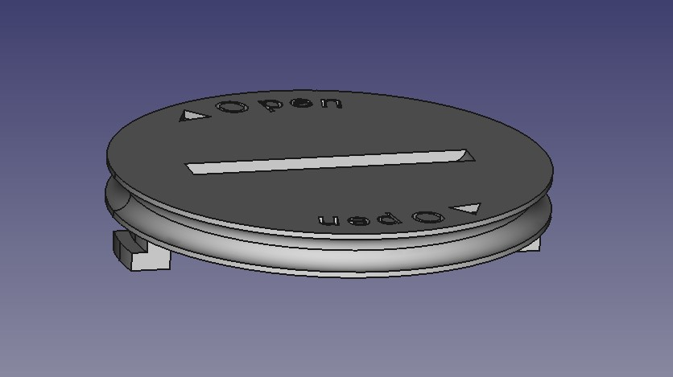

# CR2032-Clip
## 3D model of a CR2032 battery compartment

This is a sample for a spare part I like to share. I have a battery compartment with a cell type CR2032 and the lock went missing.
At this point, I have the idea to replace it with a part I print with my Ender 3 Pro.
The surrounding nut is for a seal ring.
I think someone can find also a use for it, so feel free to use it.

I used [FreeCAD](https://www.freecad.org/index.php?lang=de) for the construction and [Cura](https://ultimaker.com/de/software/ultimaker-cura/?gad_source=1) to slice it.

Thanks to [Macro_FCCircularText](https://github.com/FreeCAD/FreeCAD-macros/blob/master/ObjectCreation/Macro_FCCircularText.FCMacro) for helping me place the "< Open" text on the topside.
Note: The text on the upside is not readable at these settings. If you need them, please replace them.

## Parameters for print and slice
- Printer: Creality Ender 3 Pro
- Filament: PLA +
- Nozzle: 0.4 mm
- Layer Height: 0.1 mm
- Nozzle Temp: 215 °C
- Bed Temp: 45 °C
- Structures: On
